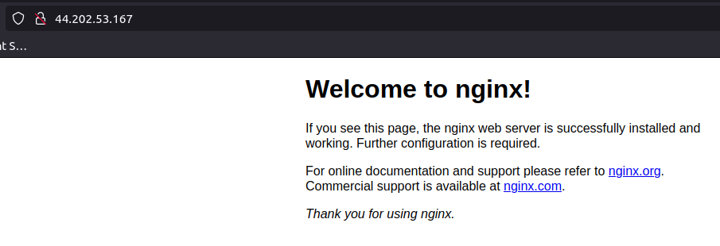
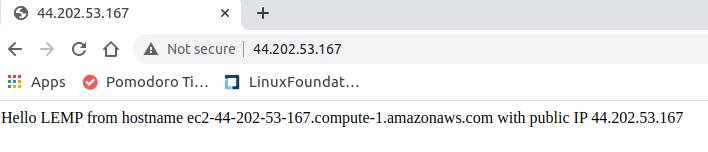
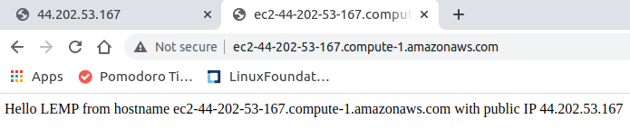
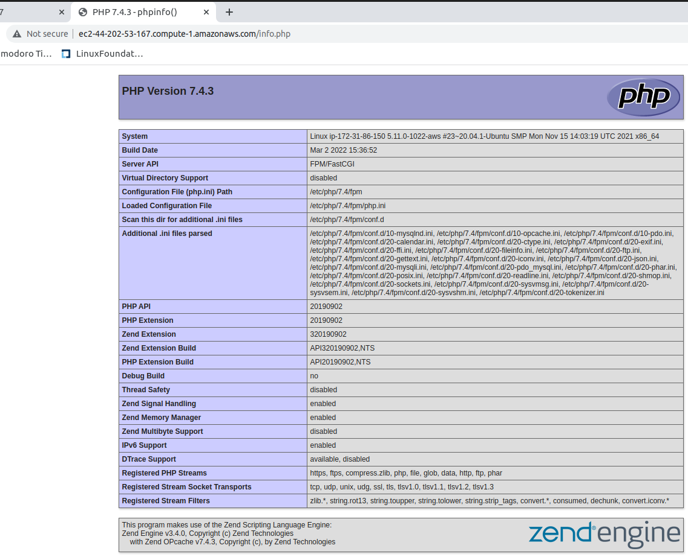

# LEMP STACK - PROJECT 2

## Install nginx
```bash
sudo apt update ; sudo apt install nginx
```
### Check if nginx is installed correctly and the web service is running:

```bash
$ sudo systemctl status nginx
● nginx.service - A high performance web server and a reverse proxy server
     Loaded: loaded (/lib/systemd/system/nginx.service; enabled; vendor preset: enabled)
     Active: active (running) since Wed 2022-03-09 22:13:45 UTC; 14s ago
       Docs: man:nginx(8)
   Main PID: 2022 (nginx)
      Tasks: 2 (limit: 1147)
     Memory: 4.9M
     CGroup: /system.slice/nginx.service
             ├─2022 nginx: master process /usr/sbin/nginx -g daemon on; master_process on;
             └─2023 nginx: worker process


ubuntu@ip-172-31-86-150:~$ curl http://localhost:80
<!DOCTYPE html>
<html>
<head>
<title>Welcome to nginx!</title>
<style>
    body {
        width: 35em;
        margin: 0 auto;
        font-family: Tahoma, Verdana, Arial, sans-serif;
    }
</style>
</head>
<body>
<h1>Welcome to nginx!</h1>
<p>If you see this page, the nginx web server is successfully installed and
working. Further configuration is required.</p>

<p>For online documentation and support please refer to
<a href="http://nginx.org/">nginx.org</a>.<br/>
Commercial support is available at
<a href="http://nginx.com/">nginx.com</a>.</p>

<p><em>Thank you for using nginx.</em></p>
</body>
</html>

OR

ubuntu@ip-172-31-86-150:~$ curl http://127.0.0.1:80
<!DOCTYPE html>
<html>
<head>
<title>Welcome to nginx!</title>
<style>
    body {
        width: 35em;
        margin: 0 auto;
        font-family: Tahoma, Verdana, Arial, sans-serif;
    }
</style>
</head>
<body>
<h1>Welcome to nginx!</h1>
<p>If you see this page, the nginx web server is successfully installed and
working. Further configuration is required.</p>

<p>For online documentation and support please refer to
<a href="http://nginx.org/">nginx.org</a>.<br/>
Commercial support is available at
<a href="http://nginx.com/">nginx.com</a>.</p>

<p><em>Thank you for using nginx.</em></p>
</body>
</html>

```
## Get public IP address and test using local web browser

```bash
ubuntu@ip-172-31-86-150:~$ curl -s http://169.254.169.254/latest/meta-data/public-ipv4
44.202.53.167
```
Web Browser Test


## Setup MySQL and run recommended security script

```bash
$ sudo apt install mysql

$ ubuntu@ip-172-31-86-150:~$ sudo mysql_secure_installation

Securing the MySQL server deployment.

Connecting to MySQL using a blank password.

VALIDATE PASSWORD COMPONENT can be used to test passwords
and improve security. It checks the strength of password
and allows the users to set only those passwords which are
secure enough. Would you like to setup VALIDATE PASSWORD component?

Press y|Y for Yes, any other key for No: y

There are three levels of password validation policy:

LOW    Length >= 8
MEDIUM Length >= 8, numeric, mixed case, and special characters
STRONG Length >= 8, numeric, mixed case, special characters and dictionary                  file

Please enter 0 = LOW, 1 = MEDIUM and 2 = STRONG: 0
Please set the password for root here.

New password: 

Re-enter new password: 

Estimated strength of the password: 50 
Do you wish to continue with the password provided?(Press y|Y for Yes, any other key for No) : y
By default, a MySQL installation has an anonymous user,
allowing anyone to log into MySQL without having to have
a user account created for them. This is intended only for
testing, and to make the installation go a bit smoother.
You should remove them before moving into a production
environment.

Remove anonymous users? (Press y|Y for Yes, any other key for No) : y
Success.


Normally, root should only be allowed to connect from
'localhost'. This ensures that someone cannot guess at
the root password from the network.

Disallow root login remotely? (Press y|Y for Yes, any other key for No) : y
Success.

By default, MySQL comes with a database named 'test' that
anyone can access. This is also intended only for testing,
and should be removed before moving into a production
environment.


Remove test database and access to it? (Press y|Y for Yes, any other key for No) : y
 - Dropping test database...
Success.

 - Removing privileges on test database...
Success.

Reloading the privilege tables will ensure that all changes
made so far will take effect immediately.

Reload privilege tables now? (Press y|Y for Yes, any other key for No) : y
Success.

All done! 
```

## Test MySQL Access
```sql
ubuntu@ip-172-31-86-150:~$ sudo mysql
Welcome to the MySQL monitor.  Commands end with ; or \g.
Your MySQL connection id is 10
Server version: 8.0.28-0ubuntu0.20.04.3 (Ubuntu)

Copyright (c) 2000, 2022, Oracle and/or its affiliates.

Oracle is a registered trademark of Oracle Corporation and/or its
affiliates. Other names may be trademarks of their respective
owners.

Type 'help;' or '\h' for help. Type '\c' to clear the current input statement.

mysql> show databases;
+--------------------+
| Database           |
+--------------------+
| information_schema |
| mysql              |
| performance_schema |
| sys                |
+--------------------+
4 rows in set (0.01 sec)

mysql> show tables from information_schema ;
+---------------------------------------+
| Tables_in_information_schema          |
+---------------------------------------+
| ADMINISTRABLE_ROLE_AUTHORIZATIONS     |
| APPLICABLE_ROLES                      |
| CHARACTER_SETS                        |
| CHECK_CONSTRAINTS                     |
| COLLATIONS                            |
| COLLATION_CHARACTER_SET_APPLICABILITY |
| COLUMNS                               |
| COLUMNS_EXTENSIONS                    |
| COLUMN_PRIVILEGES                     |
| COLUMN_STATISTICS                     |
| ENABLED_ROLES                         |
| ENGINES                               |
| EVENTS                                |
| FILES                                 |
| INNODB_BUFFER_PAGE                    |
| INNODB_BUFFER_PAGE_LRU                |
| INNODB_BUFFER_POOL_STATS              |
| INNODB_CACHED_INDEXES                 |
| INNODB_CMP                            |
| INNODB_CMPMEM                         |
| INNODB_CMPMEM_RESET                   |
| INNODB_CMP_PER_INDEX                  |
| INNODB_CMP_PER_INDEX_RESET            |
| INNODB_CMP_RESET                      |
| INNODB_COLUMNS                        |
| INNODB_DATAFILES                      |
| INNODB_FIELDS                         |
| INNODB_FOREIGN                        |
| INNODB_FOREIGN_COLS                   |
| INNODB_FT_BEING_DELETED               |
| INNODB_FT_CONFIG                      |
| INNODB_FT_DEFAULT_STOPWORD            |
| INNODB_FT_DELETED                     |
| INNODB_FT_INDEX_CACHE                 |
| INNODB_FT_INDEX_TABLE                 |
| INNODB_INDEXES                        |
| INNODB_METRICS                        |
| INNODB_SESSION_TEMP_TABLESPACES       |
| INNODB_TABLES                         |
| INNODB_TABLESPACES                    |
| INNODB_TABLESPACES_BRIEF              |
| INNODB_TABLESTATS                     |
| INNODB_TEMP_TABLE_INFO                |
| INNODB_TRX                            |
| INNODB_VIRTUAL                        |
| KEYWORDS                              |
| KEY_COLUMN_USAGE                      |
| OPTIMIZER_TRACE                       |
| PARAMETERS                            |
| PARTITIONS                            |
| PLUGINS                               |
| PROCESSLIST                           |
| PROFILING                             |
| REFERENTIAL_CONSTRAINTS               |
| RESOURCE_GROUPS                       |
| ROLE_COLUMN_GRANTS                    |
| ROLE_ROUTINE_GRANTS                   |
| ROLE_TABLE_GRANTS                     |
| ROUTINES                              |
| SCHEMATA                              |
| SCHEMATA_EXTENSIONS                   |
| SCHEMA_PRIVILEGES                     |
| STATISTICS                            |
| ST_GEOMETRY_COLUMNS                   |
| ST_SPATIAL_REFERENCE_SYSTEMS          |
| ST_UNITS_OF_MEASURE                   |
| TABLES                                |
| TABLESPACES                           |
| TABLESPACES_EXTENSIONS                |
| TABLES_EXTENSIONS                     |
| TABLE_CONSTRAINTS                     |
| TABLE_CONSTRAINTS_EXTENSIONS          |
| TABLE_PRIVILEGES                      |
| TRIGGERS                              |
| USER_ATTRIBUTES                       |
| USER_PRIVILEGES                       |
| VIEWS                                 |
| VIEW_ROUTINE_USAGE                    |
| VIEW_TABLE_USAGE                      |
+---------------------------------------+
79 rows in set (0.00 sec)

mysql> describe engines.information_schema ;
ERROR 1049 (42000): Unknown database 'engines'
mysql> describe information_schema.engines;
+--------------+-------------+------+-----+---------+-------+
| Field        | Type        | Null | Key | Default | Extra |
+--------------+-------------+------+-----+---------+-------+
| ENGINE       | varchar(64) | NO   |     |         |       |
| SUPPORT      | varchar(8)  | NO   |     |         |       |
| COMMENT      | varchar(80) | NO   |     |         |       |
| TRANSACTIONS | varchar(3)  | YES  |     |         |       |
| XA           | varchar(3)  | YES  |     |         |       |
| SAVEPOINTS   | varchar(3)  | YES  |     |         |       |
+--------------+-------------+------+-----+---------+-------+
6 rows in set (0.01 sec)
```
## Install PHP

```bash
ubuntu@ip-172-31-86-150:~$ sudo apt install php-fpm php-mysql
```

### Configure Nginx to Use PHP

Notes:
* Domain name: projectLEMP
* Create /var/www/projectLEMP and leave /var/www/html in place as the default directory to be served if a client request does not match any other sites.

```bash
ubuntu@ip-172-31-86-150:~$ sudo mkdir -p /var/www/projectLEMP
ubuntu@ip-172-31-86-150:~$ sudo chown -R $USER: /var/www/projectLEMP
```

* Create config file within Nginx's sites-available directory

```bash
ubuntu@ip-172-31-86-150:~$ sudo vi /etc/nginx/sites-available/projectLEMP
ubuntu@ip-172-31-86-150:~$ cat /etc/nginx/sites-available/projectLEMP
```
```json
#/etc/nginx/sites-available/projectLEMP

server {
    listen 80;
    server_name ec2-44-202-53-167.compute-1.amazonaws.com projectLEMP www.projectLEMP;
    root /var/www/projectLEMP;

    index index.html index.htm index.php;

    location / {
        try_files $uri $uri/ =404;
    }

    location ~ \.php$ {
        include snippets/fastcgi-php.conf;
        fastcgi_pass unix:/var/run/php/php7.4-fpm.sock;
     }

    location ~ /\.ht {
        deny all;
    }

}
```
* Configuration Activation step:
```bash
ubuntu@ip-172-31-86-150:~$ sudo ln -s /etc/nginx/sites-available/projectLEMP /etc/nginx/sites-enabled/
```
* Test config for syntax errors:
```bash
buntu@ip-172-31-86-150:~$ sudo nginx -t
nginx: [emerg] unknown directive "ec2-44-202-53-167.compute-1.amazonaws.com" in /etc/nginx/sites-enabled/projectLEMP:5
nginx: configuration file /etc/nginx/nginx.conf test failed
ubuntu@ip-172-31-86-150:~$ sudo vi /etc/nginx/sites-available/projectLEMP
ubuntu@ip-172-31-86-150:~$ sudo nginx -t
nginx: the configuration file /etc/nginx/nginx.conf syntax is ok
nginx: configuration file /etc/nginx/nginx.conf test is successful
```
* Disable the default Nginx host that is currently configured to listen on port 80 thus eliminating any conflict and reload nginx service via systemd:

```bash
ubuntu@ip-172-31-86-150:~$ sudo unlink /etc/nginx/sites-enabled/default
ubuntu@ip-172-31-86-150:~$ sudo systemctl reload nginx
```
* The new website is active now, but still empty so lets populate the index.html with something:

```bash
ubuntu@ip-172-31-86-150:~$ sudo echo 'Hello LEMP from hostname' $(curl -s http://169.254.169.254/latest/meta-data/public-hostname) 'with public IP' $(curl -s http://169.254.169.254/latest/meta-data/public-ipv4) > /var/www/projectLEMP/index.html
```
* The website now looks like this using public ip and public dns respectively:





IMPORTANT NOTE:
* "You can leave this file in place as a temporary landing page for your application until you set up an index.php file to replace it. Once you do that, remember to remove or rename the index.html file from your document root, as it would take precedence over an index.php file by default."

## Testing PHP with NGINX 

* Validation Test: Can Nginx correctly hand .php files off to the PHP processor?
    * Create a test PHP file in document root:

```bash
ubuntu@ip-172-31-86-150:~$ sudo vi /var/www/projectLEMP/info.php
ubuntu@ip-172-31-86-150:~$ cat /var/www/projectLEMP/info.php
```
```php
<?php
phpinfo();
```
    * Navigate to test page from web browser:



## Retrieving data from mysql database with php

* Create a database, database user using mysql_native_password as the default auth method:

```sql
ubuntu@ip-172-31-86-150:~$ sudo mysql
Welcome to the MySQL monitor.  Commands end with ; or \g.
Your MySQL connection id is 11
Server version: 8.0.28-0ubuntu0.20.04.3 (Ubuntu)

Copyright (c) 2000, 2022, Oracle and/or its affiliates.

Oracle is a registered trademark of Oracle Corporation and/or its
affiliates. Other names may be trademarks of their respective
owners.

Type 'help;' or '\h' for help. Type '\c' to clear the current input statement.

mysql> CREATE DATABASE `example_database`;
Query OK, 1 row affected (0.01 sec)

mysql> CREATE USER 'example_user'@'%' IDENTIFIED WITH mysql_native_password BY 'password';
Query OK, 0 rows affected (0.01 sec)

mysql> GRANT ALL ON example_database.* TO 'example_user'@'%';
Query OK, 0 rows affected (0.01 sec)

mysql> exit
Bye
```
* Test User Account created above to confirm that it has access to the database created, create a table and populate it with some items:

```sql
ubuntu@ip-172-31-86-150:~$ mysql -u example_user -p
Enter password: 
Welcome to the MySQL monitor.  Commands end with ; or \g.
Your MySQL connection id is 12
Server version: 8.0.28-0ubuntu0.20.04.3 (Ubuntu)

Copyright (c) 2000, 2022, Oracle and/or its affiliates.

Oracle is a registered trademark of Oracle Corporation and/or its
affiliates. Other names may be trademarks of their respective
owners.

Type 'help;' or '\h' for help. Type '\c' to clear the current input statement.

mysql> show databases;
+--------------------+
| Database           |
+--------------------+
| example_database   |
| information_schema |
+--------------------+
2 rows in set (0.00 sec)

mysql> CREATE TABLE example_database.todo_list (
    -> item_id INT AUTO_INCREMENT,
    -> content VARCHAR(255),
    -> PRIMARY KEY(item_id)
    -> );
Query OK, 0 rows affected (0.03 sec)

mysql> describe table example_database.todo_list ;
+----+-------------+-----------+------------+------+---------------+------+---------+------+------+----------+-------+
| id | select_type | table     | partitions | type | possible_keys | key  | key_len | ref  | rows | filtered | Extra |
+----+-------------+-----------+------------+------+---------------+------+---------+------+------+----------+-------+
|  1 | SIMPLE      | todo_list | NULL       | ALL  | NULL          | NULL | NULL    | NULL |    1 |   100.00 | NULL  |
+----+-------------+-----------+------------+------+---------------+------+---------+------+------+----------+-------+
1 row in set, 1 warning (0.01 sec)

mysql> INSERT INTO example_database.todo_list (content) VALUES ("My first important item");
Query OK, 1 row affected (0.00 sec)

mysql> select * from example_database.todo_list ;
+---------+-------------------------+
| item_id | content                 |
+---------+-------------------------+
|       1 | My first important item |
+---------+-------------------------+
1 row in set (0.00 sec)

mysql> INSERT INTO example_database.todo_list (content) VALUES ("toothbrush");
Query OK, 1 row affected (0.00 sec)

mysql> INSERT INTO example_database.todo_list (content) VALUES ("toothpaste");
Query OK, 1 row affected (0.01 sec)

mysql> INSERT INTO example_database.todo_list (content) VALUES ("undies");
Query OK, 1 row affected (0.01 sec)

mysql> INSERT INTO example_database.todo_list (content) VALUES ("towel");
Query OK, 1 row affected (0.01 sec)

mysql> INSERT INTO example_database.todo_list (content) VALUES ("sandals");
Query OK, 1 row affected (0.01 sec)

mysql> INSERT INTO example_database.todo_list (content) VALUES ("headphones");
Query OK, 1 row affected (0.00 sec)

mysql> INSERT INTO example_database.todo_list (content) VALUES ("private jet");
Query OK, 1 row affected (0.01 sec)

mysql> select * from example_database.todo_list ;
+---------+-------------------------+
| item_id | content                 |
+---------+-------------------------+
|       1 | My first important item |
|       2 | toothbrush              |
|       3 | toothpaste              |
|       4 | undies                  |
|       5 | towel                   |
|       6 | sandals                 |
|       7 | headphones              |
|       8 | private jet             |
+---------+-------------------------+
8 rows in set (0.00 sec)

mysql> exit
Bye
```
* Create a new php script that will connect to the MySQL Database and query it for content.

```bash
ubuntu@ip-172-31-86-150:~$ vi /var/www/projectLEMP/todo_list.php
ubuntu@ip-172-31-86-150:~$ cat /var/www/projectLEMP/todo_list.php
```
```php
<?php
$user = "example_user";
$password = "password";
$database = "example_database";
$table = "todo_list";

try {
  $db = new PDO("mysql:host=localhost;dbname=$database", $user, $password);
  echo "<h2>TODO</h2><ol>";
  foreach($db->query("SELECT content FROM $table") as $row) {
    echo "<li>" . $row['content'] . "</li>";
  }
  echo "</ol>";
} catch (PDOException $e) {
    print "Error!: " . $e->getMessage() . "<br/>";
    die();
}
```
* Browse to this page from the web browser to see if contents are shown:


