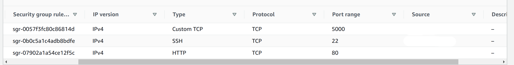

# MERN STACK IMPLEMENTATION - PROJECT 3

MERN Web stack consists of following components:

* MongoDB: A document-based, No-SQL database used to store application data in a form of documents.

* ExpressJS: A server side Web Application framework for Node.js.

* ReactJS: A frontend framework developed by Facebook. It is based on JavaScript, used to build User Interface (UI) components.

* Node.js: A JavaScript runtime environment. It is used to run JavaScript on a machine rather than in a browser.

## Types of Database Systems

| Database System Type     | Systems          |
| ------------------------ | ---------------- |
| RDBMS | Oracle, MS SQL Server, MySQL, Postgesql, DB2|
| NoSQL - Key Value Stores | Redis, Amazon DynamoDB|
| NoSQL - Wide Document Stores | Cassandra, HBase, Scylla|
| NoSQL - Document Stores | MongoDB, Couchbase|
| NoSQL - Graph Databases | Neo4J, Datastax Enterprise Graph|
| NoSQL - Search Engines | Elasticsearch, Splunk, Solr |

---
# Todo List Web Application Project
## Backend Configuration
- Install nodejs / npm
```bash
ubuntu@ip-172-31-95-128:~$ curl -sL https://deb.nodesource.com/setup_12.x | sudo -E bash -

## Installing the NodeSource Node.js 12.x repo...


## Populating apt-get cache...

+ apt-get update
Hit:1 http://us-east-1.ec2.archive.ubuntu.com/ubuntu focal InRelease
Hit:2 http://us-east-1.ec2.archive.ubuntu.com/ubuntu focal-updates InRelease                                                 
Hit:3 http://us-east-1.ec2.archive.ubuntu.com/ubuntu focal-backports InRelease                                               
Hit:4 http://security.ubuntu.com/ubuntu focal-security InRelease                                                             
Hit:5 https://deb.nodesource.com/node_12.x focal InRelease                
Reading package lists... Done                       

## Confirming "focal" is supported...

+ curl -sLf -o /dev/null 'https://deb.nodesource.com/node_12.x/dists/focal/Release'

## Adding the NodeSource signing key to your keyring...

+ curl -s https://deb.nodesource.com/gpgkey/nodesource.gpg.key | gpg --dearmor | tee /usr/share/keyrings/nodesource.gpg >/dev/null

## Creating apt sources list file for the NodeSource Node.js 12.x repo...

+ echo 'deb [signed-by=/usr/share/keyrings/nodesource.gpg] https://deb.nodesource.com/node_12.x focal main' > /etc/apt/sources.list.d/nodesource.list
+ echo 'deb-src [signed-by=/usr/share/keyrings/nodesource.gpg] https://deb.nodesource.com/node_12.x focal main' >> /etc/apt/sources.list.d/nodesource.list

## Running `apt-get update` for you...

+ apt-get update
Hit:1 http://us-east-1.ec2.archive.ubuntu.com/ubuntu focal InRelease
Hit:2 http://us-east-1.ec2.archive.ubuntu.com/ubuntu focal-updates InRelease                                                 
Hit:3 http://us-east-1.ec2.archive.ubuntu.com/ubuntu focal-backports InRelease                                               
Hit:4 http://security.ubuntu.com/ubuntu focal-security InRelease                                                             
Hit:5 https://deb.nodesource.com/node_12.x focal InRelease                
Reading package lists... Done                       

## Run `sudo apt-get install -y nodejs` to install Node.js 12.x and npm
## You may also need development tools to build native addons:
     sudo apt-get install gcc g++ make
## To install the Yarn package manager, run:
     curl -sL https://dl.yarnpkg.com/debian/pubkey.gpg | gpg --dearmor | sudo tee /usr/share/keyrings/yarnkey.gpg >/dev/null
     echo "deb [signed-by=/usr/share/keyrings/yarnkey.gpg] https://dl.yarnpkg.com/debian stable main" | sudo tee /etc/apt/sources.list.d/yarn.list
     sudo apt-get update && sudo apt-get install yarn


ubuntu@ip-172-31-95-128:~$ sudo apt-get install -y nodejs
Reading package lists... Done
Building dependency tree       
Reading state information... Done
nodejs is already the newest version (12.22.11-deb-1nodesource1).
The following package was automatically installed and is no longer required:
  libfwupdplugin1
Use 'sudo apt autoremove' to remove it.
0 upgraded, 0 newly installed, 0 to remove and 0 not upgraded.
ubuntu@ip-172-31-95-128:~$ node -v ; npm -v
v12.22.11
6.14.16
```

- Application Code Setup
```bash
ubuntu@ip-172-31-95-128:~$ cd Todo && npm init
```

## Install ExpressJS
```bash
ubuntu@ip-172-31-95-128:~/Todo$ npm install express
ubuntu@ip-172-31-95-128:~/Todo$ npm install dotenv
npm notice created a lockfile as package-lock.json. You should commit this file.
npm WARN todo@1.0.0 No description
npm WARN todo@1.0.0 No repository field.

+ dotenv@16.0.0
added 1 package and audited 1 package in 0.343s
found 0 vulnerabilities

ubuntu@ip-172-31-95-128:~/Todo$ touch index.js
ubuntu@ip-172-31-95-128:~/Todo$ npm install dotenv
npm WARN todo@1.0.0 No description
npm WARN todo@1.0.0 No repository field.

+ dotenv@16.0.0
updated 1 package and audited 1 package in 0.299s
found 0 vulnerabilities


   ╭───────────────────────────────────────────────────────────────╮
   │                                                               │
   │      New major version of npm available! 6.14.16 → 8.5.5      │
   │   Changelog: https://github.com/npm/cli/releases/tag/v8.5.5   │
   │               Run npm install -g npm to update!               │
   │                                                               │
   ╰───────────────────────────────────────────────────────────────╯

ubuntu@ip-172-31-95-128:~/Todo$ vi index.js
```
```bash
ubuntu@ip-172-31-95-128:~/Todo$ cat index.js 
```
```javascript 
const express = require('express');
require('dotenv').config();

const app = express();

const port = process.env.PORT || 5000;

app.use((req, res, next) => {
res.header("Access-Control-Allow-Origin", "\*");
res.header("Access-Control-Allow-Headers", "Origin, X-Requested-With, Content-Type, Accept");
next();
});

app.use((req, res, next) => {
res.send('Welcome to Express');
});

app.listen(port, () => {
console.log(`Server running on port ${port}`)
});
```
```bash
ubuntu@ip-172-31-95-128:~/Todo$ npm install express

ubuntu@ip-172-31-95-128:~/Todo$ node index.js 
Server running on port 5000
```

- Open the port on the aws ec2 instance



- Note: 
curl -s http://169.254.169.254/latest/meta-data/public-ipv4 for Public IP address 
or 
curl -s http://169.254.169.254/latest/meta-data/public-hostname

- Browsing to the page on port 5000 shows:


## MongoDB Database - Setup

- Note: Used mongodb.com to create a database and allow connectivity to the database I created there from the aws ubuntu linux server.
- Database connection config in ~/Todo/.env and app config index.js 
- Test connectivity of nodejs app (aws: ubuntu server) with mongodb.com database:


- Test Postman Put request:

- Test Postman Get request:

- Test Postman Delete request:


