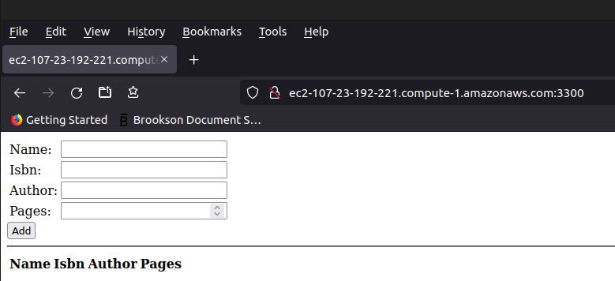

# MEAN Stack Deployment - Project 4

Goal of project:

In this assignment you are going to implement a simple Book Register web form using MEAN stack.

## Install NodeJS
- Node.js is a JavaScript runtime built on Chrome’s V8 JavaScript engine. Node.js is used in this tutorial to set up the Express routes and AngularJS controllers.

```bash
sudo apt update && sudo apt upgrade 
sudo apt -y install curl dirmngr apt-transport-https lsb-release ca-certificates
curl -fsSL https://deb.nodesource.com/setup_17.x | sudo -E bash -
sudo apt-get install -y nodejs

ubuntu@ip-172-31-30-108:~$ node -v ; npm -v
v17.7.2
8.5.2
```
Note: Instructions - https://github.com/nodesource/distributions#debinstall

## Install MongoDB, NPM
MongoDB stores data in flexible, JSON-like documents. Fields in a database can vary from document to document and data structure can be changed over time. For our example application, we are adding book records to MongoDB that contain book name, isbn number, author, and number of pages.
mages/WebConsole.gif
```bash
    8  sudo apt-key adv --keyserver hkp://keyserver.ubuntu.com:80 --recv 0C49F3730359A14518585931BC711F9BA15703C6
    9  echo "deb [ arch=amd64 ] https://repo.mongodb.org/apt/ubuntu trusty/mongodb-org/3.4 multiverse" | sudo tee /etc/apt/sources.list.d/mongodb-org-3.4.list
   10  sudo apt install -y mongodb
   11  sudo service mongodb start
   12  sudo systemctl status mongodb
   13  npm -v
   14  sudo apt install npm
   15  sudo npm install body-parser
   17  mkdir Books && cd Books
   18  npm init

ubuntu@ip-172-31-30-108:~/Books$ vi server.js
ubuntu@ip-172-31-30-108:~/Books$ cat server.js 
var express = require('express');
var bodyParser = require('body-parser');
var app = express();
app.use(express.static(__dirname + '/public'));
app.use(bodyParser.json());
require('./apps/routes')(app);
app.set('port', 3300);
app.listen(app.get('port'), function() {
    console.log('Server up: http://localhost:' + app.get('port'));
});
```
## Install Express & Setup routes to the server
Express is a minimal and flexible Node.js web application framework that provides features for web and mobile applications. We will use Express in to pass book information to and from our MongoDB database.

We also will use Mongoose package which provides a straight-forward, schema-based solution to model your application data. We will use Mongoose to establish a schema for the database to store data of our book register.

```bash
ubuntu@ip-172-31-30-108:~/Books$ sudo npm install express mongoose

added 78 packages, and audited 79 packages in 5s

6 packages are looking for funding
  run `npm fund` for details

found 0 vulnerabilities
ubuntu@ip-172-31-30-108:~/Books$ npm list
books@1.0.0 /home/ubuntu/Books
├── express@4.17.3
└── mongoose@6.2.7

```bash
ubuntu@ip-172-31-30-108:~/Books$ mkdir apps && cd apps
ubuntu@ip-172-31-30-108:~/Books/apps$ vi routes.js
ubuntu@ip-172-31-30-108:~/Books/apps$ cat routes.js 
var Book = require('./models/book');
module.exports = function(app) {
  app.get('/book', function(req, res) {
    Book.find({}, function(err, result) {
      if ( err ) throw err;
      res.json(result);
    });
  }); 
  app.post('/book', function(req, res) {
    var book = new Book( {
      name:req.body.name,
      isbn:req.body.isbn,
      author:req.body.author,
      pages:req.body.pages
    });
    book.save(function(err, result) {
      if ( err ) throw err;
      res.json( {
        message:"Successfully added book",
        book:result
      });
    });
  });
  app.delete("/book/:isbn", function(req, res) {
    Book.findOneAndRemove(req.query, function(err, result) {
      if ( err ) throw err;
      res.json( {
        message: "Successfully deleted the book",
        book: result
      });
    });
  });
  var path = require('path');
  app.get('*', function(req, res) {
    res.sendfile(path.join(__dirname + '/public', 'index.html'));
  });
};
ubuntu@ip-172-31-30-108:~/Books/apps$ mkdir models && cd models
ubuntu@ip-172-31-30-108:~/Books/apps/models$ vi book.js
ubuntu@ip-172-31-30-108:~/Books/apps/models$ cat book.js 
var mongoose = require('mongoose');
var dbHost = 'mongodb://localhost:27017/test';
mongoose.connect(dbHost);
mongoose.connection;
mongoose.set('debug', true);
var bookSchema = mongoose.Schema( {
  name: String,
  isbn: {type: String, index: true},
  author: String,
  pages: Number
});
var Book = mongoose.model('Book', bookSchema);
module.exports = mongoose.model('Book', bookSchema);
```

## Access the routes with AngularJS
AngularJS provides a web framework for creating dynamic views in your web applications. In this tutorial, we use AngularJS to connect our web page with Express and perform actions on our book register. 

```bash
ubuntu@ip-172-31-30-108:~/Books/apps/models$ cd ../..
ubuntu@ip-172-31-30-108:~/Books$ mkdir public && cd public
ubuntu@ip-172-31-30-108:~/Books/public$ vi script.js
ubuntu@ip-172-31-30-108:~/Books/public$ cat script.js 
var app = angular.module('myApp', []);
app.controller('myCtrl', function($scope, $http) {
  $http( {
    method: 'GET',
    url: '/book'
  }).then(function successCallback(response) {
    $scope.books = response.data;
  }, function errorCallback(response) {
    console.log('Error: ' + response);
  });
  $scope.del_book = function(book) {
    $http( {
      method: 'DELETE',
      url: '/book/:isbn',
      params: {'isbn': book.isbn}
    }).then(function successCallback(response) {
      console.log(response);
    }, function errorCallback(response) {
      console.log('Error: ' + response);
    });
  };
  $scope.add_book = function() {
    var body = '{ "name": "' + $scope.Name + 
    '", "isbn": "' + $scope.Isbn +
    '", "author": "' + $scope.Author + 
    '", "pages": "' + $scope.Pages + '" }';
    $http({
      method: 'POST',
      url: '/book',
      data: body
    }).then(function successCallback(response) {
      console.log(response);
    }, function errorCallback(response) {
      console.log('Error: ' + response);
    });
  };
});
ubuntu@ip-172-31-30-108:~/Books/public$ vi index.html
ubuntu@ip-172-31-30-108:~/Books/public$ cd ..
ubuntu@ip-172-31-30-108:~/Books$ node server.js
Server up: http://localhost:3300
Mongoose: books.createIndex({ isbn: 1 }, { background: true })
```
The server is now up and running, we can connect it via port 3300. You can launch a separate Putty or SSH console to test what curl command returns locally. 

```bash
^Z
[1]+  Stopped                 node server.js
ubuntu@ip-172-31-30-108:~/Books$ bg %1
[1]+ node server.js &
ubuntu@ip-172-31-30-108:~/Books$ curl -s http://localhost:3300
<!doctype html>
<html ng-app="myApp" ng-controller="myCtrl">
  <head>
    <script src="https://ajax.googleapis.com/ajax/libs/angularjs/1.6.4/angular.min.js"></script>
    <script src="script.js"></script>
  </head>
  <body>
    <div>
      <table>
        <tr>
          <td>Name:</td>
          <td><input type="text" ng-model="Name"></td>
        </tr>
        <tr>
          <td>Isbn:</td>
          <td><input type="text" ng-model="Isbn"></td>
        </tr>
        <tr>
          <td>Author:</td>
          <td><input type="text" ng-model="Author"></td>
        </tr>
        <tr>
          <td>Pages:</td>
          <td><input type="number" ng-model="Pages"></td>
        </tr>
      </table>
      <button ng-click="add_book()">Add</button>
    </div>
    <hr>
    <div>
      <table>
        <tr>
          <th>Name</th>
          <th>Isbn</th>
          <th>Author</th>
          <th>Pages</th>

        </tr>
        <tr ng-repeat="book in books">
          <td>{{book.name}}</td>
          <td>{{book.isbn}}</td>
          <td>{{book.author}}</td>
          <td>{{book.pages}}</td>

          <td><input type="button" value="Delete" data-ng-click="del_book(book)"></td>
        </tr>
      </table>
    </div>
  </body>
</html>
```



Added some bogus titles:


End of project!
