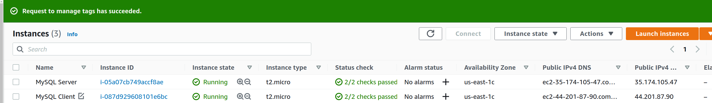
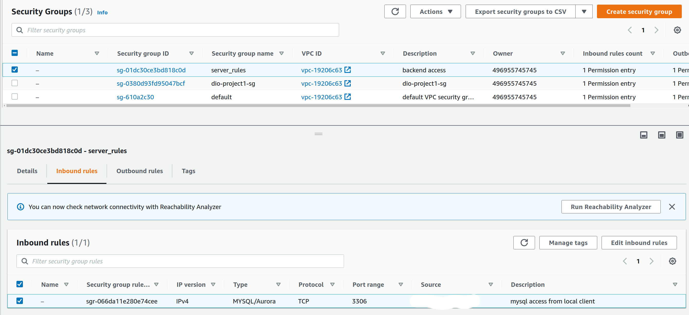
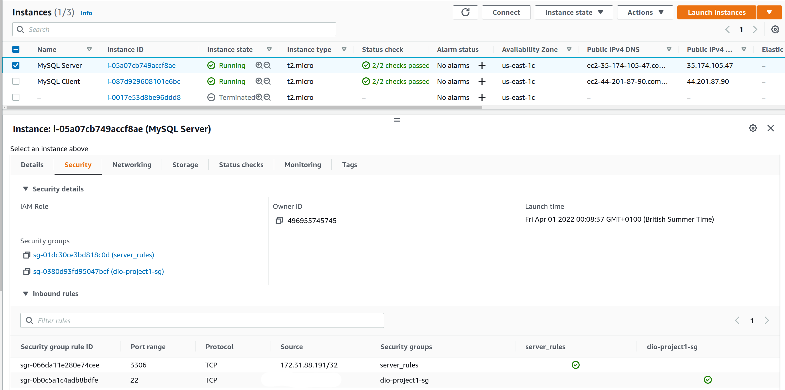

# Implement a Client Server Architecture using MySQL Database Management System (DBMS)

## Tasks

1. Create and configure two Linux-based virtual servers (EC2 instances in AWS).



2. On mysql server Linux Server install MySQL Server software. 

```bash
ubuntu@ip-172-31-85-185:~$ sudo apt-get update
Hit:1 http://us-east-1.ec2.archive.ubuntu.com/ubuntu focal InRelease
Get:2 http://us-east-1.ec2.archive.ubuntu.com/ubuntu focal-updates InRelease [114 kB]
Get:3 http://us-east-1.ec2.archive.ubuntu.com/ubuntu focal-backports InRelease [108 kB]
Get:4 http://security.ubuntu.com/ubuntu focal-security InRelease [114 kB]
Get:5 http://us-east-1.ec2.archive.ubuntu.com/ubuntu focal/universe amd64 Packages [8628 kB]
Get:6 http://us-east-1.ec2.archive.ubuntu.com/ubuntu focal/universe Translation-en [5124 kB]
Get:7 http://us-east-1.ec2.archive.ubuntu.com/ubuntu focal/universe amd64 c-n-f Metadata [265 kB]
Get:8 http://us-east-1.ec2.archive.ubuntu.com/ubuntu focal/multiverse amd64 Packages [144 kB]
Get:9 http://us-east-1.ec2.archive.ubuntu.com/ubuntu focal/multiverse Translation-en [104 kB]
Get:10 http://us-east-1.ec2.archive.ubuntu.com/ubuntu focal/multiverse amd64 c-n-f Metadata [9136 B]
Get:11 http://us-east-1.ec2.archive.ubuntu.com/ubuntu focal-updates/main amd64 Packages [1702 kB]
Get:12 http://us-east-1.ec2.archive.ubuntu.com/ubuntu focal-updates/main Translation-en [319 kB]
Get:13 http://us-east-1.ec2.archive.ubuntu.com/ubuntu focal-updates/main amd64 c-n-f Metadata [14.8 kB]
Get:14 http://us-east-1.ec2.archive.ubuntu.com/ubuntu focal-updates/restricted amd64 Packages [910 kB]
Get:15 http://us-east-1.ec2.archive.ubuntu.com/ubuntu focal-updates/restricted Translation-en [130 kB]
Get:16 http://us-east-1.ec2.archive.ubuntu.com/ubuntu focal-updates/restricted amd64 c-n-f Metadata [528 B]
Get:17 http://us-east-1.ec2.archive.ubuntu.com/ubuntu focal-updates/universe amd64 Packages [915 kB]
Get:18 http://us-east-1.ec2.archive.ubuntu.com/ubuntu focal-updates/universe Translation-en [204 kB]
Get:19 http://us-east-1.ec2.archive.ubuntu.com/ubuntu focal-updates/universe amd64 c-n-f Metadata [20.4 kB]
Get:20 http://us-east-1.ec2.archive.ubuntu.com/ubuntu focal-updates/multiverse amd64 Packages [24.4 kB]
Get:21 http://us-east-1.ec2.archive.ubuntu.com/ubuntu focal-updates/multiverse Translation-en [7336 B]
Get:22 http://us-east-1.ec2.archive.ubuntu.com/ubuntu focal-updates/multiverse amd64 c-n-f Metadata [592 B]
Get:23 http://us-east-1.ec2.archive.ubuntu.com/ubuntu focal-backports/main amd64 Packages [42.2 kB]
Get:24 http://us-east-1.ec2.archive.ubuntu.com/ubuntu focal-backports/main Translation-en [10.1 kB]
Get:25 http://us-east-1.ec2.archive.ubuntu.com/ubuntu focal-backports/main amd64 c-n-f Metadata [864 B]
Get:26 http://us-east-1.ec2.archive.ubuntu.com/ubuntu focal-backports/restricted amd64 c-n-f Metadata [116 B]
Get:27 http://us-east-1.ec2.archive.ubuntu.com/ubuntu focal-backports/universe amd64 Packages [22.7 kB]
Get:28 http://us-east-1.ec2.archive.ubuntu.com/ubuntu focal-backports/universe Translation-en [15.5 kB]
Get:29 http://us-east-1.ec2.archive.ubuntu.com/ubuntu focal-backports/universe amd64 c-n-f Metadata [808 B]
Get:30 http://us-east-1.ec2.archive.ubuntu.com/ubuntu focal-backports/multiverse amd64 c-n-f Metadata [116 B]
Get:31 http://security.ubuntu.com/ubuntu focal-security/main amd64 Packages [1377 kB]
Get:32 http://security.ubuntu.com/ubuntu focal-security/main Translation-en [238 kB]
Get:33 http://security.ubuntu.com/ubuntu focal-security/main amd64 c-n-f Metadata [9876 B]
Get:34 http://security.ubuntu.com/ubuntu focal-security/restricted amd64 Packages [853 kB]
Get:35 http://security.ubuntu.com/ubuntu focal-security/restricted Translation-en [122 kB]
Get:36 http://security.ubuntu.com/ubuntu focal-security/restricted amd64 c-n-f Metadata [532 B]
Get:37 http://security.ubuntu.com/ubuntu focal-security/universe amd64 Packages [695 kB]
Get:38 http://security.ubuntu.com/ubuntu focal-security/universe Translation-en [122 kB]
Get:39 http://security.ubuntu.com/ubuntu focal-security/universe amd64 c-n-f Metadata [14.1 kB]
Get:40 http://security.ubuntu.com/ubuntu focal-security/multiverse amd64 Packages [20.7 kB]
Get:41 http://security.ubuntu.com/ubuntu focal-security/multiverse Translation-en [5196 B]
Get:42 http://security.ubuntu.com/ubuntu focal-security/multiverse amd64 c-n-f Metadata [500 B]
Fetched 22.4 MB in 4s (5583 kB/s)                                
Reading package lists... Done
ubuntu@ip-172-31-85-185:~$ sudo apt install mysql-server
Reading package lists... Done
Building dependency tree       
Reading state information... Done
The following additional packages will be installed:
  libcgi-fast-perl libcgi-pm-perl libencode-locale-perl libevent-core-2.1-7 libevent-pthreads-2.1-7 libfcgi-perl libhtml-parser-perl libhtml-tagset-perl
  libhtml-template-perl libhttp-date-perl libhttp-message-perl libio-html-perl liblwp-mediatypes-perl libmecab2 libtimedate-perl liburi-perl mecab-ipadic
  mecab-ipadic-utf8 mecab-utils mysql-client-8.0 mysql-client-core-8.0 mysql-common mysql-server-8.0 mysql-server-core-8.0
Suggested packages:
  libdata-dump-perl libipc-sharedcache-perl libwww-perl mailx tinyca
The following NEW packages will be installed:
  libcgi-fast-perl libcgi-pm-perl libencode-locale-perl libevent-core-2.1-7 libevent-pthreads-2.1-7 libfcgi-perl libhtml-parser-perl libhtml-tagset-perl
  libhtml-template-perl libhttp-date-perl libhttp-message-perl libio-html-perl liblwp-mediatypes-perl libmecab2 libtimedate-perl liburi-perl mecab-ipadic
  mecab-ipadic-utf8 mecab-utils mysql-client-8.0 mysql-client-core-8.0 mysql-common mysql-server mysql-server-8.0 mysql-server-core-8.0
0 upgraded, 25 newly installed, 0 to remove and 95 not upgraded.
Need to get 23.8 MB/31.4 MB of archives.
After this operation, 262 MB of additional disk space will be used.
Do you want to continue? [Y/n] y
Get:1 http://us-east-1.ec2.archive.ubuntu.com/ubuntu focal-updates/main amd64 mysql-client-core-8.0 amd64 8.0.28-0ubuntu0.20.04.3 [4429 kB]
Get:2 http://us-east-1.ec2.archive.ubuntu.com/ubuntu focal-updates/main amd64 mysql-client-8.0 amd64 8.0.28-0ubuntu0.20.04.3 [22.0 kB]
Get:3 http://us-east-1.ec2.archive.ubuntu.com/ubuntu focal-updates/main amd64 mysql-server-core-8.0 amd64 8.0.28-0ubuntu0.20.04.3 [18.0 MB]
Get:4 http://us-east-1.ec2.archive.ubuntu.com/ubuntu focal-updates/main amd64 mysql-server-8.0 amd64 8.0.28-0ubuntu0.20.04.3 [1271 kB]
Get:5 http://us-east-1.ec2.archive.ubuntu.com/ubuntu focal-updates/main amd64 mysql-server all 8.0.28-0ubuntu0.20.04.3 [9544 B]
Fetched 23.8 MB in 0s (57.8 MB/s) 
Preconfiguring packages ...
Selecting previously unselected package mysql-common.
(Reading database ... 63895 files and directories currently installed.)
Preparing to unpack .../0-mysql-common_5.8+1.0.5ubuntu2_all.deb ...
Unpacking mysql-common (5.8+1.0.5ubuntu2) ...
Selecting previously unselected package mysql-client-core-8.0.
Preparing to unpack .../1-mysql-client-core-8.0_8.0.28-0ubuntu0.20.04.3_amd64.deb ...
Unpacking mysql-client-core-8.0 (8.0.28-0ubuntu0.20.04.3) ...
Selecting previously unselected package mysql-client-8.0.
Preparing to unpack .../2-mysql-client-8.0_8.0.28-0ubuntu0.20.04.3_amd64.deb ...
Unpacking mysql-client-8.0 (8.0.28-0ubuntu0.20.04.3) ...
Selecting previously unselected package libevent-core-2.1-7:amd64.
Preparing to unpack .../3-libevent-core-2.1-7_2.1.11-stable-1_amd64.deb ...
Unpacking libevent-core-2.1-7:amd64 (2.1.11-stable-1) ...
Selecting previously unselected package libevent-pthreads-2.1-7:amd64.
Preparing to unpack .../4-libevent-pthreads-2.1-7_2.1.11-stable-1_amd64.deb ...
Unpacking libevent-pthreads-2.1-7:amd64 (2.1.11-stable-1) ...
Selecting previously unselected package libmecab2:amd64.
Preparing to unpack .../5-libmecab2_0.996-10build1_amd64.deb ...
Unpacking libmecab2:amd64 (0.996-10build1) ...
Selecting previously unselected package mysql-server-core-8.0.
Preparing to unpack .../6-mysql-server-core-8.0_8.0.28-0ubuntu0.20.04.3_amd64.deb ...
Unpacking mysql-server-core-8.0 (8.0.28-0ubuntu0.20.04.3) ...
Setting up mysql-common (5.8+1.0.5ubuntu2) ...
update-alternatives: using /etc/mysql/my.cnf.fallback to provide /etc/mysql/my.cnf (my.cnf) in auto mode
Selecting previously unselected package mysql-server-8.0.
(Reading database ... 64117 files and directories currently installed.)
Preparing to unpack .../00-mysql-server-8.0_8.0.28-0ubuntu0.20.04.3_amd64.deb ...
Unpacking mysql-server-8.0 (8.0.28-0ubuntu0.20.04.3) ...
Selecting previously unselected package libhtml-tagset-perl.
Preparing to unpack .../01-libhtml-tagset-perl_3.20-4_all.deb ...
Unpacking libhtml-tagset-perl (3.20-4) ...
Selecting previously unselected package liburi-perl.
Preparing to unpack .../02-liburi-perl_1.76-2_all.deb ...
Unpacking liburi-perl (1.76-2) ...
Selecting previously unselected package libhtml-parser-perl.
Preparing to unpack .../03-libhtml-parser-perl_3.72-5_amd64.deb ...
Unpacking libhtml-parser-perl (3.72-5) ...
Selecting previously unselected package libcgi-pm-perl.
Preparing to unpack .../04-libcgi-pm-perl_4.46-1_all.deb ...
Unpacking libcgi-pm-perl (4.46-1) ...
Selecting previously unselected package libfcgi-perl.
Preparing to unpack .../05-libfcgi-perl_0.79-1_amd64.deb ...
Unpacking libfcgi-perl (0.79-1) ...
Selecting previously unselected package libcgi-fast-perl.
Preparing to unpack .../06-libcgi-fast-perl_1%3a2.15-1_all.deb ...
Unpacking libcgi-fast-perl (1:2.15-1) ...
Selecting previously unselected package libencode-locale-perl.
Preparing to unpack .../07-libencode-locale-perl_1.05-1_all.deb ...
Unpacking libencode-locale-perl (1.05-1) ...
Selecting previously unselected package libhtml-template-perl.
Preparing to unpack .../08-libhtml-template-perl_2.97-1_all.deb ...
Unpacking libhtml-template-perl (2.97-1) ...
Selecting previously unselected package libtimedate-perl.
Preparing to unpack .../09-libtimedate-perl_2.3200-1_all.deb ...
Unpacking libtimedate-perl (2.3200-1) ...
Selecting previously unselected package libhttp-date-perl.
Preparing to unpack .../10-libhttp-date-perl_6.05-1_all.deb ...
Unpacking libhttp-date-perl (6.05-1) ...
Selecting previously unselected package libio-html-perl.
Preparing to unpack .../11-libio-html-perl_1.001-1_all.deb ...
Unpacking libio-html-perl (1.001-1) ...
Selecting previously unselected package liblwp-mediatypes-perl.
Preparing to unpack .../12-liblwp-mediatypes-perl_6.04-1_all.deb ...
Unpacking liblwp-mediatypes-perl (6.04-1) ...
Selecting previously unselected package libhttp-message-perl.
Preparing to unpack .../13-libhttp-message-perl_6.22-1_all.deb ...
Unpacking libhttp-message-perl (6.22-1) ...
Selecting previously unselected package mecab-utils.
Preparing to unpack .../14-mecab-utils_0.996-10build1_amd64.deb ...
Unpacking mecab-utils (0.996-10build1) ...
Selecting previously unselected package mecab-ipadic.
Preparing to unpack .../15-mecab-ipadic_2.7.0-20070801+main-2.1_all.deb ...
Unpacking mecab-ipadic (2.7.0-20070801+main-2.1) ...
Selecting previously unselected package mecab-ipadic-utf8.
Preparing to unpack .../16-mecab-ipadic-utf8_2.7.0-20070801+main-2.1_all.deb ...
Unpacking mecab-ipadic-utf8 (2.7.0-20070801+main-2.1) ...
Selecting previously unselected package mysql-server.
Preparing to unpack .../17-mysql-server_8.0.28-0ubuntu0.20.04.3_all.deb ...
Unpacking mysql-server (8.0.28-0ubuntu0.20.04.3) ...
Setting up libmecab2:amd64 (0.996-10build1) ...
Setting up mysql-client-core-8.0 (8.0.28-0ubuntu0.20.04.3) ...
Setting up libhtml-tagset-perl (3.20-4) ...
Setting up liblwp-mediatypes-perl (6.04-1) ...
Setting up libencode-locale-perl (1.05-1) ...
Setting up mecab-utils (0.996-10build1) ...
Setting up libevent-core-2.1-7:amd64 (2.1.11-stable-1) ...
Setting up libio-html-perl (1.001-1) ...
Setting up libtimedate-perl (2.3200-1) ...
Setting up mysql-client-8.0 (8.0.28-0ubuntu0.20.04.3) ...
Setting up libfcgi-perl (0.79-1) ...
Setting up liburi-perl (1.76-2) ...
Setting up libevent-pthreads-2.1-7:amd64 (2.1.11-stable-1) ...
Setting up libhttp-date-perl (6.05-1) ...
Setting up mecab-ipadic (2.7.0-20070801+main-2.1) ...
Compiling IPA dictionary for Mecab.  This takes long time...
reading /usr/share/mecab/dic/ipadic/unk.def ... 40
emitting double-array: 100% |###########################################| 
/usr/share/mecab/dic/ipadic/model.def is not found. skipped.
reading /usr/share/mecab/dic/ipadic/Noun.org.csv ... 16668
reading /usr/share/mecab/dic/ipadic/Adnominal.csv ... 135
reading /usr/share/mecab/dic/ipadic/Conjunction.csv ... 171
reading /usr/share/mecab/dic/ipadic/Adj.csv ... 27210
reading /usr/share/mecab/dic/ipadic/Postp-col.csv ... 91
reading /usr/share/mecab/dic/ipadic/Noun.adjv.csv ... 3328
reading /usr/share/mecab/dic/ipadic/Noun.adverbal.csv ... 795
reading /usr/share/mecab/dic/ipadic/Interjection.csv ... 252
reading /usr/share/mecab/dic/ipadic/Noun.nai.csv ... 42
reading /usr/share/mecab/dic/ipadic/Noun.verbal.csv ... 12146
reading /usr/share/mecab/dic/ipadic/Prefix.csv ... 221
reading /usr/share/mecab/dic/ipadic/Symbol.csv ... 208
reading /usr/share/mecab/dic/ipadic/Noun.number.csv ... 42
reading /usr/share/mecab/dic/ipadic/Noun.place.csv ... 72999
reading /usr/share/mecab/dic/ipadic/Verb.csv ... 130750
reading /usr/share/mecab/dic/ipadic/Noun.others.csv ... 151
reading /usr/share/mecab/dic/ipadic/Noun.csv ... 60477
reading /usr/share/mecab/dic/ipadic/Suffix.csv ... 1393
reading /usr/share/mecab/dic/ipadic/Noun.demonst.csv ... 120
reading /usr/share/mecab/dic/ipadic/Noun.name.csv ... 34202
reading /usr/share/mecab/dic/ipadic/Postp.csv ... 146
reading /usr/share/mecab/dic/ipadic/Filler.csv ... 19
reading /usr/share/mecab/dic/ipadic/Auxil.csv ... 199
reading /usr/share/mecab/dic/ipadic/Others.csv ... 2
reading /usr/share/mecab/dic/ipadic/Adverb.csv ... 3032
reading /usr/share/mecab/dic/ipadic/Noun.proper.csv ... 27328
emitting double-array: 100% |###########################################| 
reading /usr/share/mecab/dic/ipadic/matrix.def ... 1316x1316
emitting matrix      : 100% |###########################################| 

done!
update-alternatives: using /var/lib/mecab/dic/ipadic to provide /var/lib/mecab/dic/debian (mecab-dictionary) in auto mode
Setting up mysql-server-core-8.0 (8.0.28-0ubuntu0.20.04.3) ...
Setting up mecab-ipadic-utf8 (2.7.0-20070801+main-2.1) ...
Compiling IPA dictionary for Mecab.  This takes long time...
reading /usr/share/mecab/dic/ipadic/unk.def ... 40
emitting double-array: 100% |###########################################| 
/usr/share/mecab/dic/ipadic/model.def is not found. skipped.
reading /usr/share/mecab/dic/ipadic/Noun.org.csv ... 16668
reading /usr/share/mecab/dic/ipadic/Adnominal.csv ... 135
reading /usr/share/mecab/dic/ipadic/Conjunction.csv ... 171
reading /usr/share/mecab/dic/ipadic/Adj.csv ... 27210
reading /usr/share/mecab/dic/ipadic/Postp-col.csv ... 91
reading /usr/share/mecab/dic/ipadic/Noun.adjv.csv ... 3328
reading /usr/share/mecab/dic/ipadic/Noun.adverbal.csv ... 795
reading /usr/share/mecab/dic/ipadic/Interjection.csv ... 252
reading /usr/share/mecab/dic/ipadic/Noun.nai.csv ... 42
reading /usr/share/mecab/dic/ipadic/Noun.verbal.csv ... 12146
reading /usr/share/mecab/dic/ipadic/Prefix.csv ... 221
reading /usr/share/mecab/dic/ipadic/Symbol.csv ... 208
reading /usr/share/mecab/dic/ipadic/Noun.number.csv ... 42
reading /usr/share/mecab/dic/ipadic/Noun.place.csv ... 72999
reading /usr/share/mecab/dic/ipadic/Verb.csv ... 130750
reading /usr/share/mecab/dic/ipadic/Noun.others.csv ... 151
reading /usr/share/mecab/dic/ipadic/Noun.csv ... 60477
reading /usr/share/mecab/dic/ipadic/Suffix.csv ... 1393
reading /usr/share/mecab/dic/ipadic/Noun.demonst.csv ... 120
reading /usr/share/mecab/dic/ipadic/Noun.name.csv ... 34202
reading /usr/share/mecab/dic/ipadic/Postp.csv ... 146
reading /usr/share/mecab/dic/ipadic/Filler.csv ... 19
reading /usr/share/mecab/dic/ipadic/Auxil.csv ... 199
reading /usr/share/mecab/dic/ipadic/Others.csv ... 2
reading /usr/share/mecab/dic/ipadic/Adverb.csv ... 3032
reading /usr/share/mecab/dic/ipadic/Noun.proper.csv ... 27328
emitting double-array: 100% |###########################################| 
reading /usr/share/mecab/dic/ipadic/matrix.def ... 1316x1316
emitting matrix      : 100% |###########################################| 

done!
update-alternatives: using /var/lib/mecab/dic/ipadic-utf8 to provide /var/lib/mecab/dic/debian (mecab-dictionary) in auto mode
Setting up libhtml-parser-perl (3.72-5) ...
Setting up libhttp-message-perl (6.22-1) ...
Setting up mysql-server-8.0 (8.0.28-0ubuntu0.20.04.3) ...
update-alternatives: using /etc/mysql/mysql.cnf to provide /etc/mysql/my.cnf (my.cnf) in auto mode
Renaming removed key_buffer and myisam-recover options (if present)
mysqld will log errors to /var/log/mysql/error.log
mysqld is running as pid 3174
Created symlink /etc/systemd/system/multi-user.target.wants/mysql.service → /lib/systemd/system/mysql.service.
Setting up libcgi-pm-perl (4.46-1) ...
Setting up libhtml-template-perl (2.97-1) ...
Setting up mysql-server (8.0.28-0ubuntu0.20.04.3) ...
Setting up libcgi-fast-perl (1:2.15-1) ...
Processing triggers for systemd (245.4-4ubuntu3.13) ...
Processing triggers for man-db (2.9.1-1) ...
Processing triggers for libc-bin (2.31-0ubuntu9.2) ...
ubuntu@ip-172-31-85-185:~$ dpkg -l | grep -i mysql*
ii  mysql-client-8.0                   8.0.28-0ubuntu0.20.04.3               amd64        MySQL database client binaries
ii  mysql-client-core-8.0              8.0.28-0ubuntu0.20.04.3               amd64        MySQL database core client binaries
ii  mysql-common                       5.8+1.0.5ubuntu2                      all          MySQL database common files, e.g. /etc/mysql/my.cnf
ii  mysql-server                       8.0.28-0ubuntu0.20.04.3               all          MySQL database server (metapackage depending on the latest version)
ii  mysql-server-8.0                   8.0.28-0ubuntu0.20.04.3               amd64        MySQL database server binaries and system database setup
ii  mysql-server-core-8.0              8.0.28-0ubuntu0.20.04.3               amd64        MySQL database server binaries
ubuntu@ip-172-31-85-185:~$ which -a mysql
/usr/bin/mysql
/bin/mysql

ubuntu@ip-172-31-85-185:~$ mysql --version
mysql  Ver 8.0.28-0ubuntu0.20.04.3 for Linux on x86_64 ((Ubuntu))
```

3. On mysql client Linux Server install MySQL Client software

```bash
ubuntu@ip-172-31-88-191:~$ sudo apt update && sudo apt install mysql-client
Hit:1 http://us-east-1.ec2.archive.ubuntu.com/ubuntu focal InRelease
Get:2 http://us-east-1.ec2.archive.ubuntu.com/ubuntu focal-updates InRelease [114 kB]
Get:3 http://us-east-1.ec2.archive.ubuntu.com/ubuntu focal-backports InRelease [108 kB]
Get:4 http://security.ubuntu.com/ubuntu focal-security InRelease [114 kB]
Get:5 http://us-east-1.ec2.archive.ubuntu.com/ubuntu focal/universe amd64 Packages [8628 kB]
Get:6 http://security.ubuntu.com/ubuntu focal-security/main amd64 Packages [1377 kB]
Get:7 http://security.ubuntu.com/ubuntu focal-security/main Translation-en [238 kB]
Get:8 http://security.ubuntu.com/ubuntu focal-security/main amd64 c-n-f Metadata [9876 B]
Get:9 http://security.ubuntu.com/ubuntu focal-security/restricted amd64 Packages [853 kB]
Get:10 http://security.ubuntu.com/ubuntu focal-security/restricted Translation-en [122 kB]
Get:11 http://security.ubuntu.com/ubuntu focal-security/restricted amd64 c-n-f Metadata [532 B]
Get:12 http://security.ubuntu.com/ubuntu focal-security/universe amd64 Packages [695 kB]    
Get:13 http://security.ubuntu.com/ubuntu focal-security/universe Translation-en [122 kB]
Get:14 http://security.ubuntu.com/ubuntu focal-security/universe amd64 c-n-f Metadata [14.1 kB]
Get:15 http://security.ubuntu.com/ubuntu focal-security/multiverse amd64 Packages [20.7 kB]   
Get:16 http://security.ubuntu.com/ubuntu focal-security/multiverse Translation-en [5196 B]
Get:17 http://security.ubuntu.com/ubuntu focal-security/multiverse amd64 c-n-f Metadata [500 B]
Get:18 http://us-east-1.ec2.archive.ubuntu.com/ubuntu focal/universe Translation-en [5124 kB]
Get:19 http://us-east-1.ec2.archive.ubuntu.com/ubuntu focal/universe amd64 c-n-f Metadata [265 kB]
Get:20 http://us-east-1.ec2.archive.ubuntu.com/ubuntu focal/multiverse amd64 Packages [144 kB]
Get:21 http://us-east-1.ec2.archive.ubuntu.com/ubuntu focal/multiverse Translation-en [104 kB]
Get:22 http://us-east-1.ec2.archive.ubuntu.com/ubuntu focal/multiverse amd64 c-n-f Metadata [9136 B]
Get:23 http://us-east-1.ec2.archive.ubuntu.com/ubuntu focal-updates/main amd64 Packages [1702 kB]
Get:24 http://us-east-1.ec2.archive.ubuntu.com/ubuntu focal-updates/main Translation-en [319 kB]
Get:25 http://us-east-1.ec2.archive.ubuntu.com/ubuntu focal-updates/main amd64 c-n-f Metadata [14.8 kB]
Get:26 http://us-east-1.ec2.archive.ubuntu.com/ubuntu focal-updates/restricted amd64 Packages [910 kB]
Get:27 http://us-east-1.ec2.archive.ubuntu.com/ubuntu focal-updates/restricted Translation-en [130 kB]
Get:28 http://us-east-1.ec2.archive.ubuntu.com/ubuntu focal-updates/restricted amd64 c-n-f Metadata [528 B]
Get:29 http://us-east-1.ec2.archive.ubuntu.com/ubuntu focal-updates/universe amd64 Packages [915 kB]
Get:30 http://us-east-1.ec2.archive.ubuntu.com/ubuntu focal-updates/universe Translation-en [204 kB]
Get:31 http://us-east-1.ec2.archive.ubuntu.com/ubuntu focal-updates/universe amd64 c-n-f Metadata [20.4 kB]
Get:32 http://us-east-1.ec2.archive.ubuntu.com/ubuntu focal-updates/multiverse amd64 Packages [24.4 kB]
Get:33 http://us-east-1.ec2.archive.ubuntu.com/ubuntu focal-updates/multiverse Translation-en [7336 B]
Get:34 http://us-east-1.ec2.archive.ubuntu.com/ubuntu focal-updates/multiverse amd64 c-n-f Metadata [592 B]
Get:35 http://us-east-1.ec2.archive.ubuntu.com/ubuntu focal-backports/main amd64 Packages [42.2 kB]
Get:36 http://us-east-1.ec2.archive.ubuntu.com/ubuntu focal-backports/main Translation-en [10.1 kB]
Get:37 http://us-east-1.ec2.archive.ubuntu.com/ubuntu focal-backports/main amd64 c-n-f Metadata [864 B]
Get:38 http://us-east-1.ec2.archive.ubuntu.com/ubuntu focal-backports/restricted amd64 c-n-f Metadata [116 B]
Get:39 http://us-east-1.ec2.archive.ubuntu.com/ubuntu focal-backports/universe amd64 Packages [22.7 kB]
Get:40 http://us-east-1.ec2.archive.ubuntu.com/ubuntu focal-backports/universe Translation-en [15.5 kB]
Get:41 http://us-east-1.ec2.archive.ubuntu.com/ubuntu focal-backports/universe amd64 c-n-f Metadata [808 B]
Get:42 http://us-east-1.ec2.archive.ubuntu.com/ubuntu focal-backports/multiverse amd64 c-n-f Metadata [116 B]
Fetched 22.4 MB in 4s (5504 kB/s)               
Reading package lists... Done
Building dependency tree       
Reading state information... Done
95 packages can be upgraded. Run 'apt list --upgradable' to see them.
Reading package lists... Done
Building dependency tree       
Reading state information... Done
The following additional packages will be installed:
  mysql-client-8.0 mysql-client-core-8.0 mysql-common
The following NEW packages will be installed:
  mysql-client mysql-client-8.0 mysql-client-core-8.0 mysql-common
0 upgraded, 4 newly installed, 0 to remove and 95 not upgraded.
Need to get 4468 kB of archives.
After this operation, 67.1 MB of additional disk space will be used.
Do you want to continue? [Y/n] y
Get:1 http://us-east-1.ec2.archive.ubuntu.com/ubuntu focal-updates/main amd64 mysql-client-core-8.0 amd64 8.0.28-0ubuntu0.20.04.3 [4429 kB]
Get:2 http://us-east-1.ec2.archive.ubuntu.com/ubuntu focal/main amd64 mysql-common all 5.8+1.0.5ubuntu2 [7496 B]
Get:3 http://us-east-1.ec2.archive.ubuntu.com/ubuntu focal-updates/main amd64 mysql-client-8.0 amd64 8.0.28-0ubuntu0.20.04.3 [22.0 kB]
Get:4 http://us-east-1.ec2.archive.ubuntu.com/ubuntu focal-updates/main amd64 mysql-client all 8.0.28-0ubuntu0.20.04.3 [9420 B]
Fetched 4468 kB in 4s (1239 kB/s) 
Selecting previously unselected package mysql-client-core-8.0.
(Reading database ... 63895 files and directories currently installed.)
Preparing to unpack .../mysql-client-core-8.0_8.0.28-0ubuntu0.20.04.3_amd64.deb ...
Unpacking mysql-client-core-8.0 (8.0.28-0ubuntu0.20.04.3) ...
Selecting previously unselected package mysql-common.
Preparing to unpack .../mysql-common_5.8+1.0.5ubuntu2_all.deb ...
Unpacking mysql-common (5.8+1.0.5ubuntu2) ...
Selecting previously unselected package mysql-client-8.0.
Preparing to unpack .../mysql-client-8.0_8.0.28-0ubuntu0.20.04.3_amd64.deb ...
Unpacking mysql-client-8.0 (8.0.28-0ubuntu0.20.04.3) ...
Selecting previously unselected package mysql-client.
Preparing to unpack .../mysql-client_8.0.28-0ubuntu0.20.04.3_all.deb ...
Unpacking mysql-client (8.0.28-0ubuntu0.20.04.3) ...
Setting up mysql-common (5.8+1.0.5ubuntu2) ...
update-alternatives: using /etc/mysql/my.cnf.fallback to provide /etc/mysql/my.cnf (my.cnf) in auto mode
Setting up mysql-client-core-8.0 (8.0.28-0ubuntu0.20.04.3) ...
Setting up mysql-client-8.0 (8.0.28-0ubuntu0.20.04.3) ...
Setting up mysql-client (8.0.28-0ubuntu0.20.04.3) ...
Processing triggers for man-db (2.9.1-1) ...
ubuntu@ip-172-31-88-191:~$ which -a mysql-client
ubuntu@ip-172-31-88-191:~$ which -a mysql
/usr/bin/mysql
/bin/mysql
ubuntu@ip-172-31-88-191:~$ sudo dpkg -l | grep -i mysql
ii  mysql-client                       8.0.28-0ubuntu0.20.04.3               all          MySQL database client (metapackage depending on the latest version)
ii  mysql-client-8.0                   8.0.28-0ubuntu0.20.04.3               amd64        MySQL database client binaries
ii  mysql-client-core-8.0              8.0.28-0ubuntu0.20.04.3               amd64        MySQL database core client binaries
ii  mysql-common                       5.8+1.0.5ubuntu2                      all          MySQL database common files, e.g. /etc/mysql/my.cnf
ubuntu@ip-172-31-88-191:~$ 
```
4. By default, both of your EC2 virtual servers are located in the same local virtual network, so they can communicate to each other using local IP addresses. Use mysql server's local IP address to connect from mysql client. MySQL server uses TCP port 3306 by default, so you will have to open it by creating a new entry in ‘Inbound rules’ in ‘mysql server’ Security Groups. For extra security, do not allow all IP addresses to reach your ‘mysql server’ – allow access only to the specific local IP address of your ‘mysql client’.

- Create a new security group to allow access to mysql server:


- Attach to mysql-server server:



